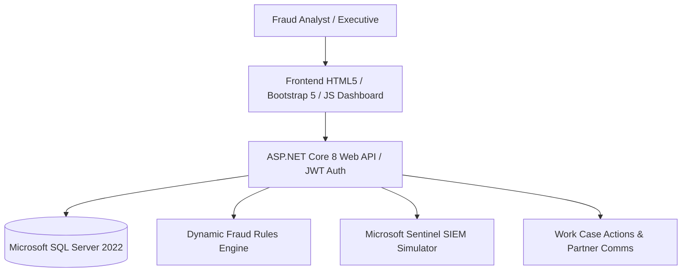

# Enterprise Fraud Risk Management System (EFRS)

[](https://github.com/Abishek412001/Enterprise-Fraud-Risk-Management-System/actions)
[](LICENSE)
[](https://dotnet.microsoft.com/)
[](https://www.microsoft.com/sql-server/)

An enterprise-grade, multi-tenant Fraud Risk Management (FRM), Account Takeover (ATO) Monitoring, and Microsoft Sentinel-inspired SIEM Alert Management Platform designed for Tier-1 banks, payment processors, and fintech platforms.


## 🌐 Live Demo

Experience the Enterprise Fraud Risk Management System through the live interactive demonstration.

### 🚀 Live Application

**Streamlit Demo:**  
https://enterprise-fraud-risk-management-system-5mop3gaiuy8kyw3xaqgpzf.streamlit.app/

### What You Can Explore

- 🔐 Secure Login & Authentication
- 📊 Executive Fraud Dashboard
- 👥 Customer Management
- 💳 Account & Card Management
- 💰 Transaction Monitoring
- 🚨 Fraud Alert Management
- 🛡️ Account Takeover (ATO) Investigation
- 📈 Risk Scoring & Fraud Analytics
- 📑 Investigation Case Management
- 📋 Reports & Business Intelligence
- 📉 Fraud Trend Analysis
- 🔍 Search, Filter & Drill-down Capabilities

### Demo Highlights

The live application demonstrates a realistic enterprise fraud operations workflow inspired by modern banking environments, including:

- Fraud alert generation and monitoring
- Risk score calculation
- Investigation lifecycle management
- Executive KPI dashboards
- Interactive reporting
- Banking transaction analytics
- SQL-driven fraud detection
- Responsive enterprise UI

---

## 🌟 Architectural Overview



---

## 🚀 Key Modules & Capabilities

1. **FRM Alert Management**: Real-time rule triggers, severity assignment, and alert lifecycle tracking.
2. **Account Takeover (ATO) Monitoring**: Device fingerprinting, impossible travel detection, brute force failed login analysis.
3. **Microsoft Sentinel SIEM Integration**: Incident correlation, threat intelligence IP indicators, security event telemetry.
4. **Enterprise Case Management & SLA Engine**: Case creation, priority-based SLA resolution timer tracking, escalation workflows.
5. **Fraud Investigation Workspace & Customer 360**: High-privilege account freeze/unfreeze, card suspension, device blocking, evidence locker.
6. **Work Case Actions (WCA) & Partner Comms**: Immutable audit trails and secure partner dispatching (Visa, Mastercard, Law Enforcement).
7. **BI Fraud Metrics & Reporting**: Automated telemetry, Chart.js executive dashboards, PDF/CSV report exporter.
8. **Enterprise RBAC & Security**: 9 fine-grained security roles, JWT token handling, security audit logs.

---

## 🛠️ Quick Start & Local Setup

### Prerequisites
- .NET 8.0 SDK
- Microsoft SQL Server 2022 (or Express)
- Docker Desktop (Optional)

```bash
# 1. Clone repository
git clone https://github.com/Abishek412001/Enterprise-Fraud-Risk-Management-System.git
cd Enterprise-Fraud-Risk-Management-System

# 2. Run Database Script
sqlcmd -S localhost\SQLEXPRESS -d EnterpriseFraudRiskDB -i database/schema.sql

# 3. Start Backend Web API
dotnet run --project backend/EnterpriseFraudRiskSystem.csproj
```

---

## 📄 Documentation Sitemap

- [Architecture.md](docs/Architecture.md)
- [API.md](docs/API.md)
- [Database.md](docs/Database.md)
- [Deployment.md](docs/Deployment.md)
- [DeveloperGuide.md](docs/DeveloperGuide.md)
- [AnalystGuide.md](docs/AnalystGuide.md)
- [AdminGuide.md](docs/AdminGuide.md)
- [SecurityGuide.md](docs/SecurityGuide.md)
